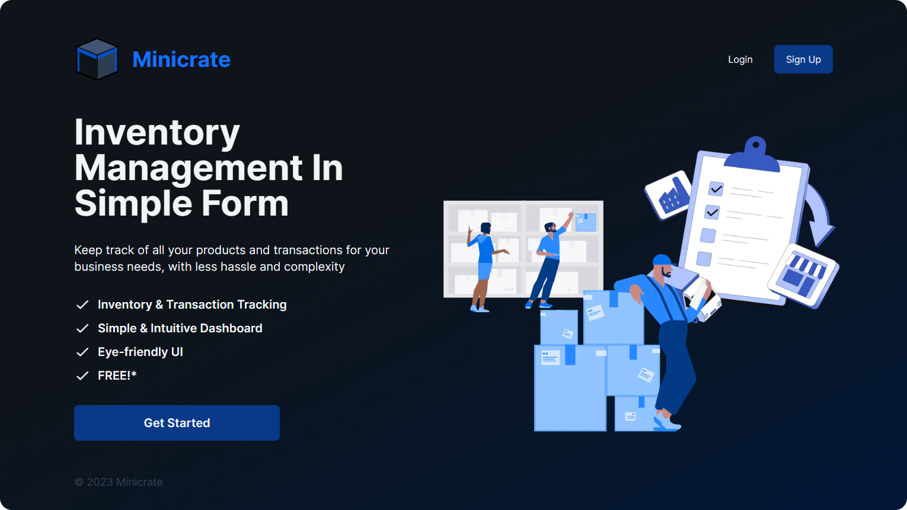

# Group G Project - Minicrate

## 👋 Greetings! 

Are you running a small business and got some products that you need to manage? Or even a list of transactions that you need to keep track of? And you don't need the complexity of a huge e-commerce system?

Minicrate aims to make your inventory management easy and keep the process relatively simple. Simply create to your account and start adding your list of things to keep track of.

## 🔗 Link to Website

### [https://minicrate-project.vercel.app/](https://minicrate-project.vercel.app/)

## 🤝 Team

| Name            |          Main Role |
| :-------------- | -----------------: |
| Derian Melvin   |   Frontend UI & UX |
| Ichsan Zulfikar | Frontend & Backend |

## 🛠️ Tools & Technologies

### Front-end

### Back-end

### Others
